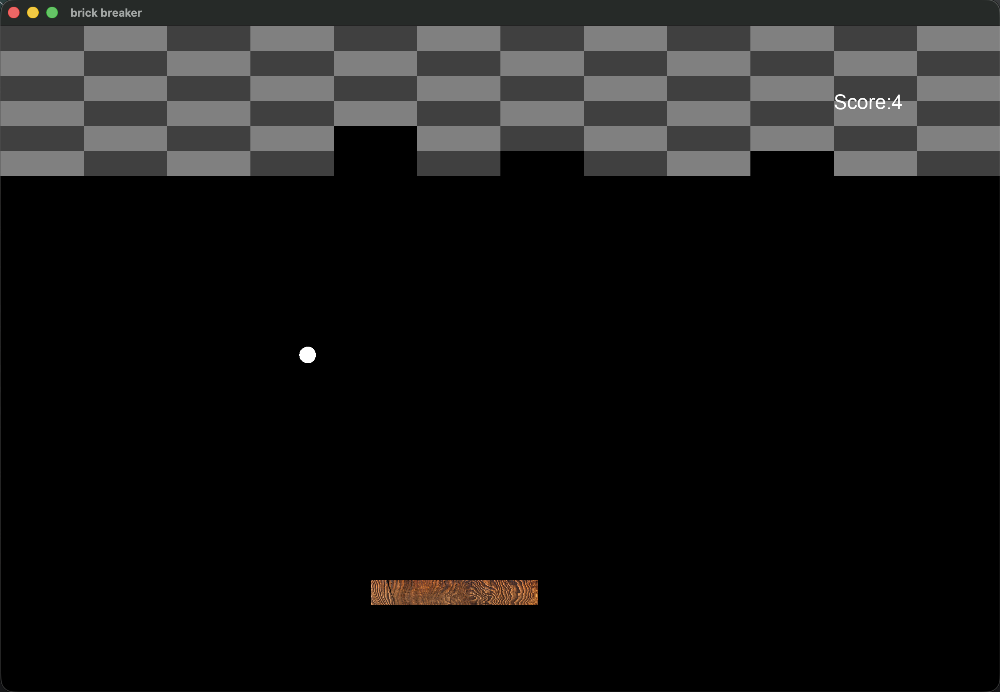

# brick breaker

A brick breaker game using OpenGL and c programing language

third-party library:
```
glad
glfw
cglm
FreeType
```

## Build
1. installed vcpkg and cmake
2. execute the following command
```
vcpkg install glfw3 glad cglm FreeType

cmake -B build -DCMAKE_TOOLCHAIN_FILE="your_vcpkg_dir/scripts/buildsystems/vcpkg.cmake"
```

screenshot

